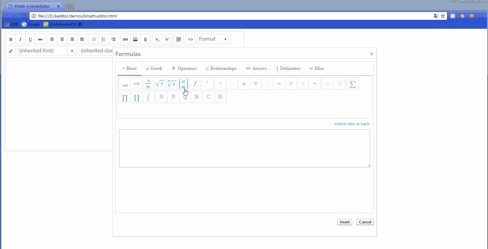
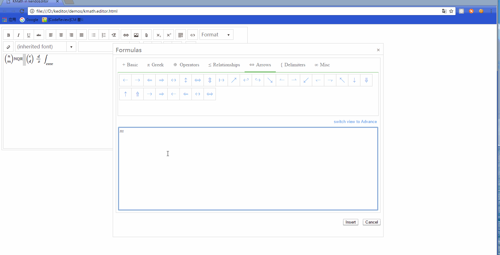

# keditor 

/play letitgo

extend kendo editor for edit &amp; review   math

## REF

- [kendo-api](http://docs.telerik.com/kendo-ui/api/javascript/ui/editor#events-execute)
- [mathjax](http://docs.mathjax.org/en/latest/start.html)
- [latex editor](https://arachnoid.com/latex/)
- [mathquill](http://mathquill.com/)
- [limit-calculator martix](https://www.symbolab.com/solver/limit-calculator)
- [eqneditor vector](https://www.codecogs.com/latex/eqneditor.php)
## demo

- [KMath](https://sharpgui.github.io/keditor/demos/mathboard.html)
- [DEMO in KendoEditor](https://sharpgui.github.io/keditor/demos/kmath.editor.html)
- [DEMO in kendoWindow](https://sharpgui.github.io/keditor/demos/kmath.window.html)

## 效果图

## Basic view 支持一些键盘操作
- m^n  上标
- m_n  下标
- M*N  乘
- m/n  除
- \sqrt+space出现根号  \sum+space             支持latex 输入如果了解

## TODO
- [ ] mathboard KMath 中添加判断一页只执行一次addStyleNode
