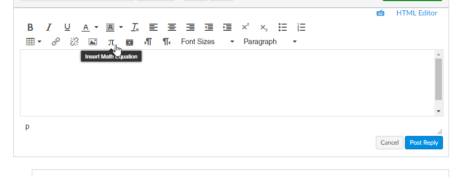
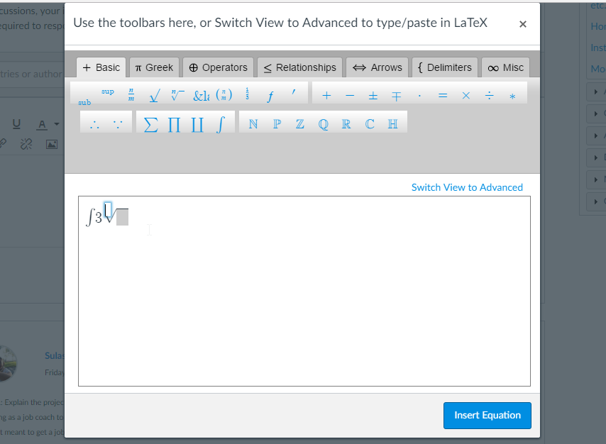
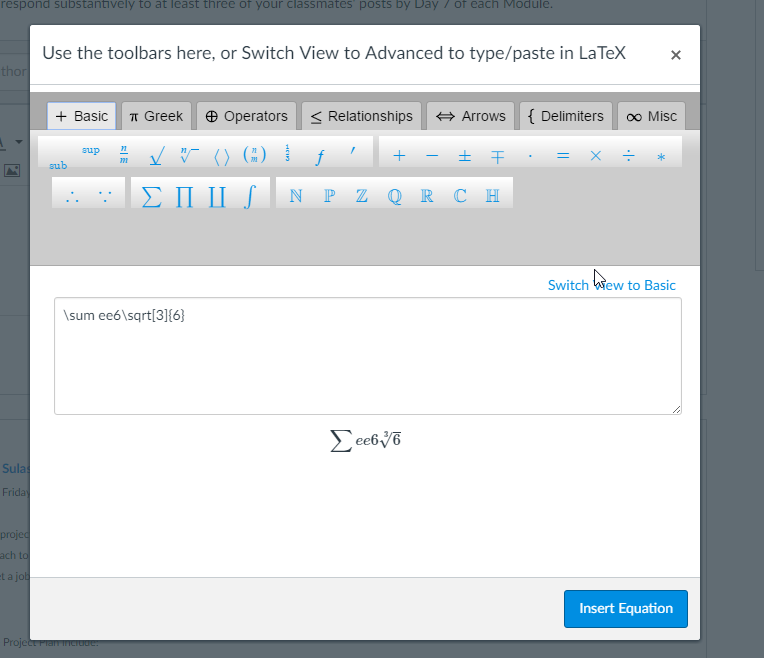
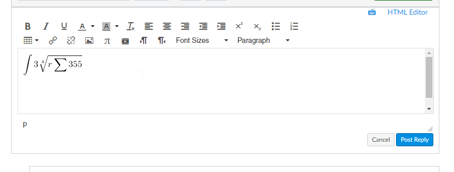

# keditor
extend kendo editor for edit &amp; review   math

## REF

- [kendo-api](http://docs.telerik.com/kendo-ui/api/javascript/ui/editor#events-execute)
- [mathjax](http://docs.mathjax.org/en/latest/start.html)
- [latex editor](https://arachnoid.com/latex/)
## demo

- [第一版](https://sharpgui.github.io/keditor/keditor.html)

## 设计图

> 1

> 2

> 3

> 4

